# LoyaltyGo — diagramy sekwencji użycia API

Uzupełnienie kontraktów z [`openapi.yaml`](./openapi.yaml). Każdy diagram pokazuje
konkretny przypadek użycia i metody API, które w nim uczestniczą.

Aktorzy powtarzający się na diagramach:

| Aktor | Opis |
|---|---|
| **Klient** | telefon klienta (aparat + Apple/Google Wallet, bez aplikacji) |
| **Landing programu** | dedykowany, publiczny landing page programu jako osobny projekt na własnej domenie (`karta.loyaltygo.pl/{inviteCode}`, osobno od panelu merchanta pod `app.loyaltygo.pl`) — cel przekierowania z QR; branding merchanta, formularz dołączenia, przycisk "Dodaj do Apple/Google Wallet" |
| **SoftPOS/SDK** | aplikacja SoftPOS z wbudowanym SDK iOS LoyaltyGo |
| **Panel** | SPA panelu merchanta |
| **API** | backend LoyaltyGo (Supabase Edge Functions / PostgREST) |
| **Supabase Auth** | uwierzytelnianie merchanta (magic link / OTP / Apple / Google) — poza kontraktem OpenAPI |
| **PassKit** | zewnętrzny wystawca kart (passkit.com) |
| **E-mail** | wysyłka wiadomości transakcyjnych |

## Pokrycie metod

| Metoda API | operationId | Diagramy |
|---|---|---|
| `GET /public/invites/{code}` | `getInvite` | 1, 2, 11 |
| `POST /public/invites/{code}/join` | `joinProgram` | 1, 2 |
| `POST /public/invites/{code}/card-recovery` | `recoverCard` | 3 |
| `GET /public/card-links/{token}` | `getCardLink` | 2, 3 |
| `GET /sdk/program` | `sdkGetProgram` | 4 |
| `POST /sdk/scans` | `sdkScanCard` | 4, 5, 6, 9, 10, 11 |
| `POST /sdk/transactions` | `sdkRegisterTransaction` | 5, 6, 7, 10 |
| `POST /sdk/transactions/{id}/cancellation` | `sdkCancelTransaction` | 8 |
| `GET /panel/merchant` | `getMerchant` | 4 |
| `PATCH /panel/merchant` | `updateMerchant` | 4 |
| `GET /panel/program` | `getProgram` | 4, 12 |
| `PATCH /panel/program` | `updateProgram` | 4, 12 |
| `POST /panel/program/logo` | `uploadLogo` | 4 |
| `POST /panel/program/publish` | `publishProgram` | 4 |
| `POST /panel/program/suspend` | `suspendProgram` | 11 |
| `POST /panel/program/resume` | `resumeProgram` | 11 |
| `POST /panel/program/close` | `closeProgram` | 11 |
| `GET /panel/program/key` | `getProgramKey` | 4 |
| `POST /panel/program/key` (rotate) | `rotateProgramKey` | 9 |
| `GET /panel/members` | `listMembers` | 10 |
| `GET /panel/members/{id}` | `getMember` | 10 |
| `POST /panel/members/{id}/block` | `blockMember` | 10 |
| `POST /panel/members/{id}/unblock` | `unblockMember` | 10 |
| `GET /panel/offers` | `listOffers` | 6 |
| `POST /panel/offers` | `createOffer` | 6 |
| `POST /panel/offers/{id}/deactivate` | `deactivateOffer` | 6 |
| `GET /panel/transactions` | `listTransactions` | 5, 7, 8 |
| `GET /panel/sync-rejections` | `listSyncRejections` | 7 |
| `GET /ops/pass-discrepancies` | `listPassDiscrepancies` | 13 |
| `POST /ops/memberships/{id}/reissue-pass` | `reissuePass` | 13 |
| `POST /ops/memberships/{id}/erasure` | `eraseMembership` | 14 |

---

## 1. Onboarding klienta — dołączenie do programu

Ścieżka podstawowa (spec `02-klient-onboarding.feature`) plus wariant awarii
wystawcy kart. Formularz nie weryfikuje własności adresu e-mail, dlatego dla
adresu z istniejącym członkostwem karta **nigdy nie wraca w odpowiedzi** —
idzie linkiem na skrzynkę właściciela, a strona pokazuje komunikat „być może"
(ochrona przed przejęciem cudzej karty i punktów).

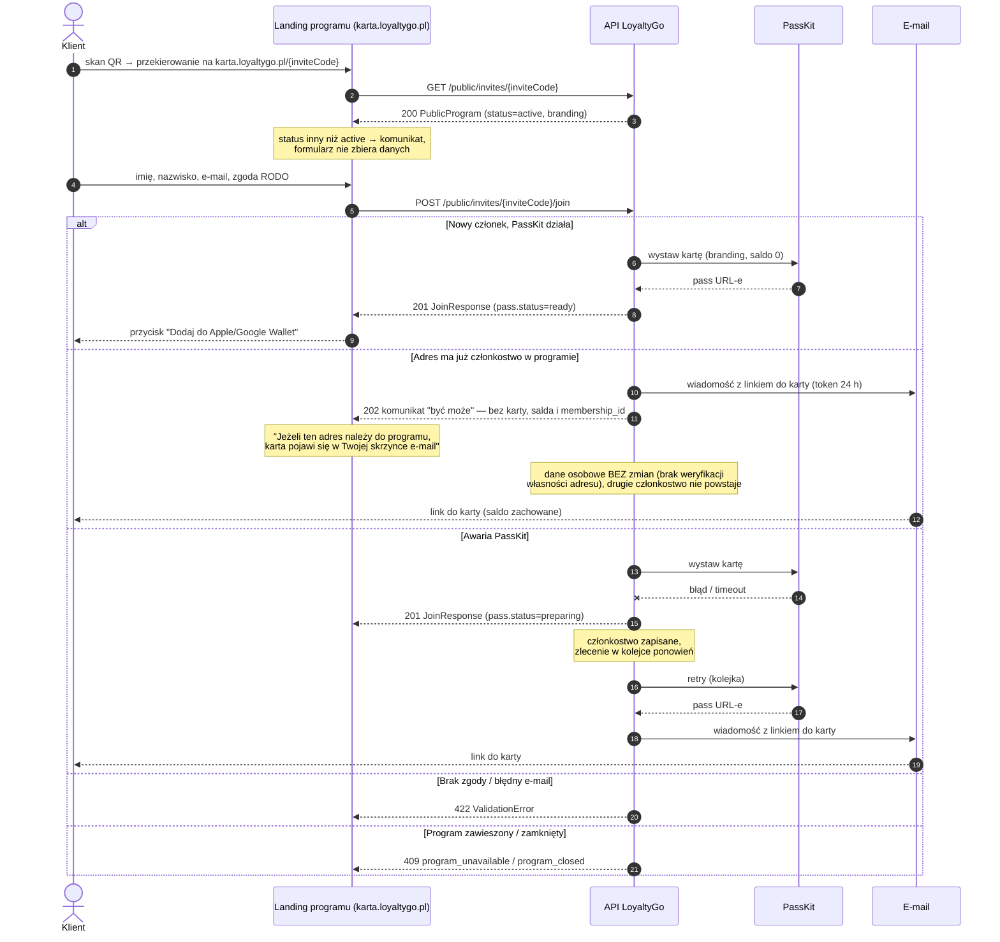

## 2. Onboarding przy kasie — karta użyta od razu w transakcji

Klient dołącza w trakcie wizyty; świeżo wydana karta jest natychmiast skanowana
(spec `02` + `03`). Wariant: karta nie zdążyła się wydać przed końcem płatności.

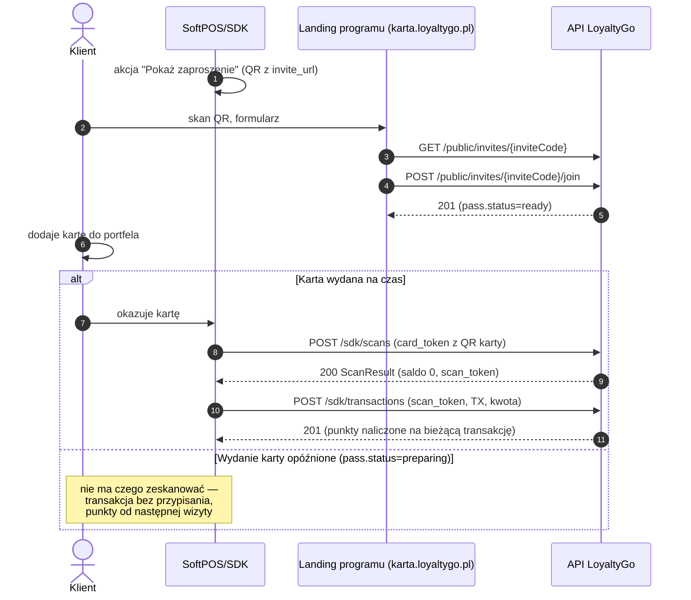

## 3. Odzyskanie karty (nowy telefon / karta usunięta z portfela)

Spec `02` — sekcja "Odzyskiwanie karty". Odpowiedź `recoverCard` zawsze 202,
niezależnie czy członkostwo istnieje (brak enumeracji kont). Link ważny 24 h.

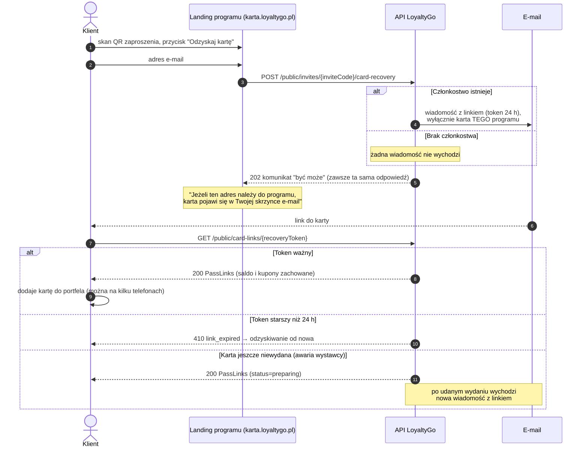

## 4. Merchant — pierwsze logowanie, konfiguracja i publikacja programu

Spec `01`. Uwierzytelnianie robi Supabase Auth (poza kontraktem OpenAPI);
konto merchanta powstaje przy pierwszym uwierzytelnieniu. Klucz programu
dostępny dopiero po publikacji.

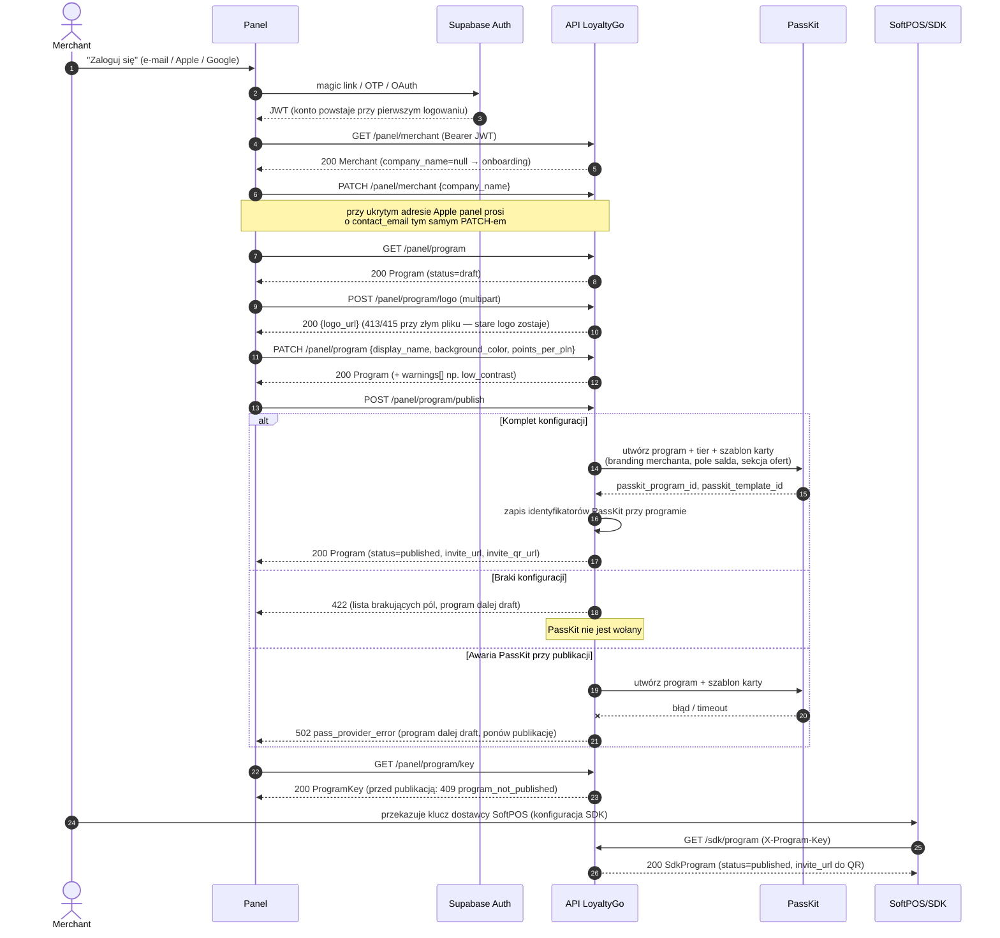

## 5. Skan karty i rejestracja transakcji online (bez kuponu)

Spec `03` — ścieżka podstawowa + idempotencja + wygaśnięcie kontekstu skanu.

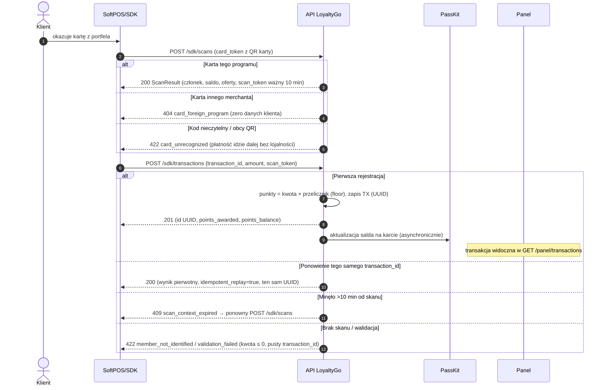

## 6. Oferty — cykl życia kuponu i realizacja przy transakcji

Spec `04`. Kupon konsumowany atomowo w `sdkRegisterTransaction`, nigdy przy
skanie. Niedostępny kupon nie blokuje transakcji (ostrzeżenie); przy wielu
kuponach obowiązuje wszystko-albo-nic.

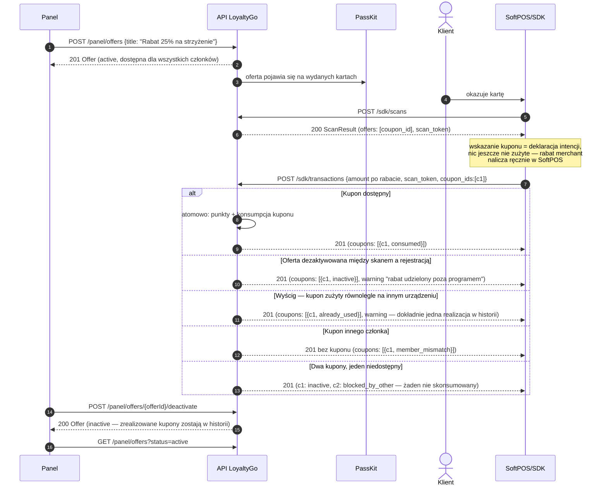

## 7. Tryb offline — kolejka SDK i synchronizacja

Spec `03` + `04` (offline). Kupony offline zablokowane. Kolejka: limit 500
wpisów / 7 dni; odrzuty widoczne w panelu.

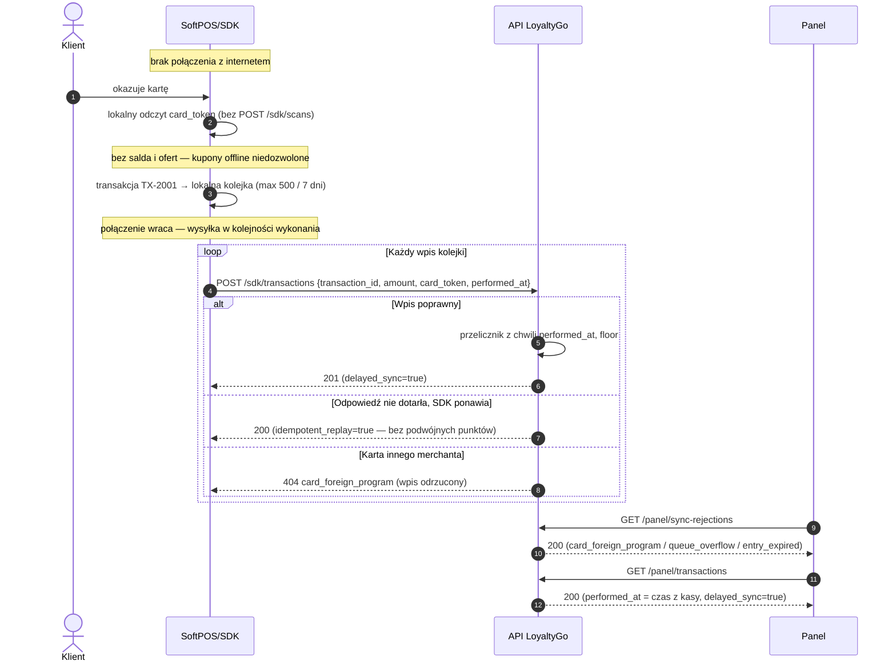

## 8. Zwrot — anulowanie naliczenia punktów

Spec `03` — sekcja zwrotów, `04` — zwrot z kuponem. Zwrot transakcji czekającej
jeszcze w kolejce offline nie woła API — SDK usuwa wpis lokalnie.

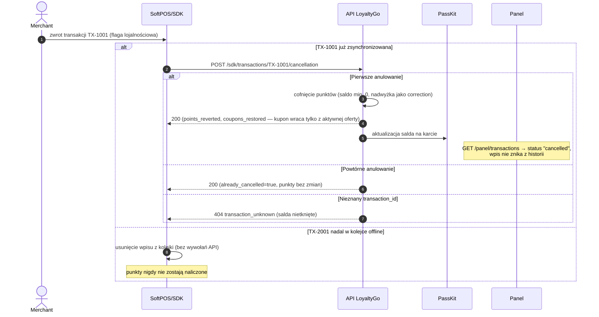

## 9. Rotacja klucza programu

Spec `01` — "Unieważnienie i wymiana klucza programu". Stary klucz przestaje
działać natychmiast; nic nie trafia do kolejki offline SDK.

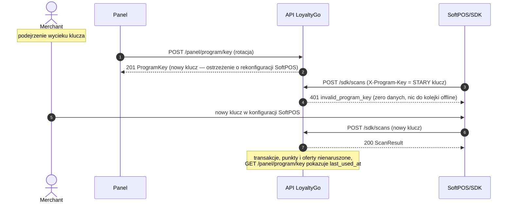

## 10. Blokada i odblokowanie członka

Spec `01` + `03`. Transakcja offline wykonana **przed** blokadą jest po
synchronizacji przyjmowana (liczy się stan z `performed_at`).

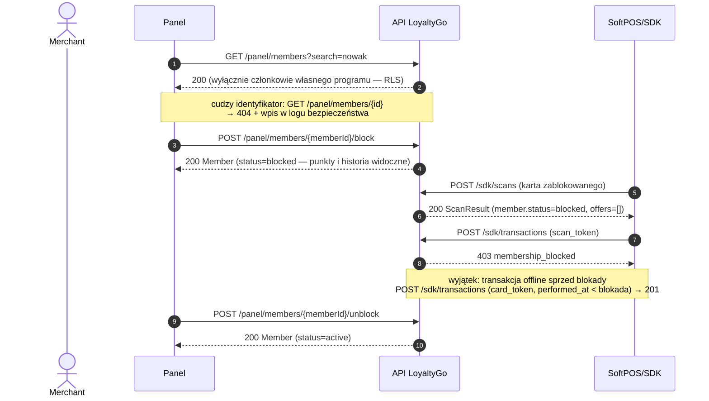

## 11. Cykl życia programu — zawieszenie, wznowienie, zamknięcie

Spec `01` + `02`. Zamknięcie wymaga potwierdzenia (409 zwraca skutki).

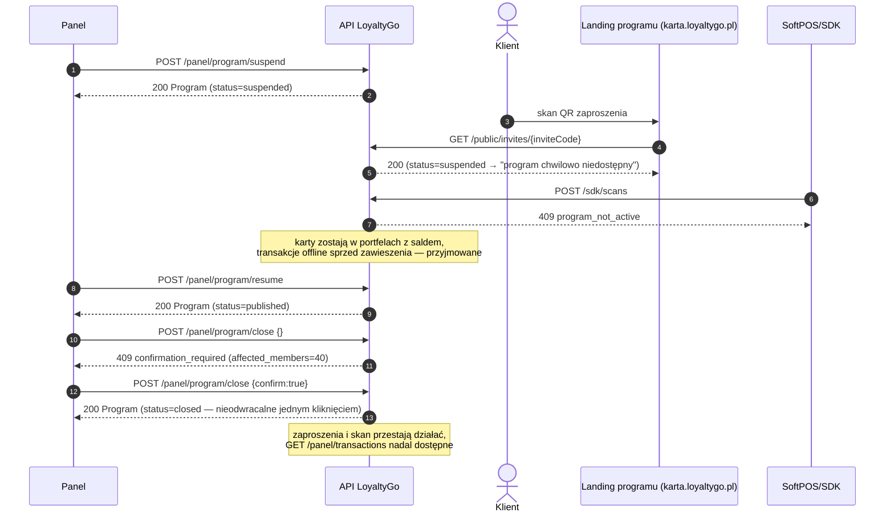

## 12. Zmiana brandingu po wydaniu kart — propagacja

Spec `01` + `05`. Punkty i oferty nietknięte; panel pokazuje status propagacji.

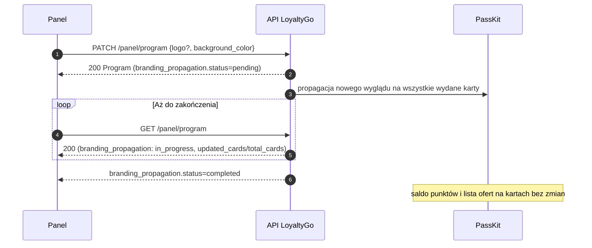

## 13. Operator — rozbieżność karty z backendem i ponowne wystawienie

Spec `05`. Backend jest źródłem prawdy — rozbieżność nigdy nie kosztuje punktów.

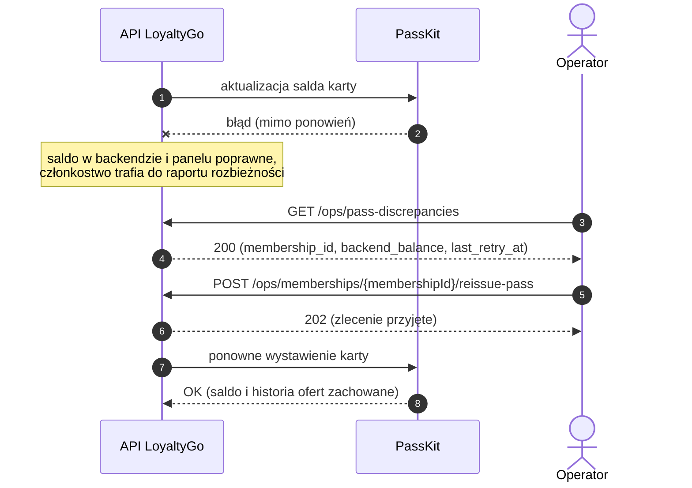

## 14. RODO — żądanie usunięcia danych klienta

Spec `05`. Ścieżka poza aplikacją: klient → merchant → operator.

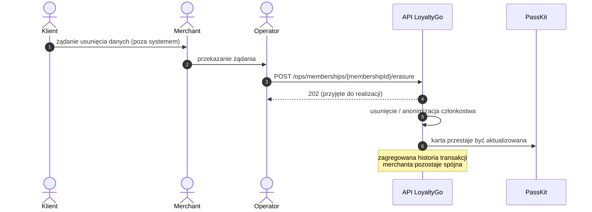
